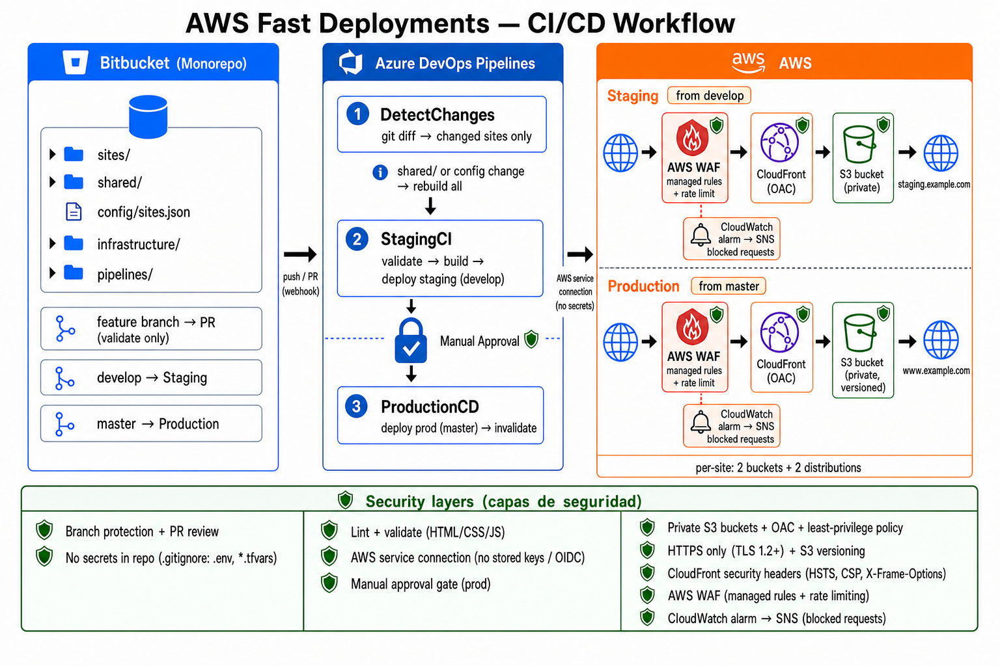

# 🚀 AWS Fast Deployments

**Language / Idioma:** [English](#english) · [Español](#español)

<a id="english"></a>

A **boilerplate monorepo** for hosting many static sites (HTML/CSS/JS) on
**AWS (S3 + CloudFront)** with a fully automated **Azure DevOps** CI/CD pipeline,
sourced from **Bitbucket**.

When you change a site, only *that* site is validated, built, deployed to
staging, and — after a manual approval — promoted to production. Cache
invalidations are scoped to the paths that actually changed.

```
Bitbucket (monorepo)  ──►  Azure DevOps Pipelines  ──►  AWS (S3 + CloudFront)
   push / PR                 detect → validate →           per-site buckets
                             build → deploy(staging)        + distributions
                             → approval → deploy(prod)
```



## Documentation

| Document | What it covers |
|----------|----------------|
| [`docs/README.md`](docs/README.md) | Index of all guides in `docs/`. |
| [`docs/site-checklist.md`](docs/site-checklist.md) | **Main checklist** — per-site README, owner/maintainer, code, security, new site steps. |
| [`docs/html-guidelines.md`](docs/html-guidelines.md) | HTML/CSS/JS best practices and security (linting, CSP, a11y, SEO). |
| [`docs/workflow.png`](docs/workflow.png) | CI/CD workflow diagram. |

Per-folder READMEs: [`config/`](config/README.md) · [`shared/`](shared/README.md) ·
[`infrastructure/`](infrastructure/README.md) · [`pipelines/`](pipelines/README.md)

## Repository layout

```
.
├── sites/                    # one folder per static site (the site source)
│   ├── example-site/src/...
│   └── marketing-site/src/...
├── shared/                   # reusable CSS/JS/assets across sites
├── config/
│   ├── sites.json            # ⭐ central registry: site → buckets + distributions
│   └── sites.schema.json
├── infrastructure/           # Terraform IaC
│   ├── modules/static-site/  #   reusable module (1 bucket + 1 distribution)
│   └── deployments/          #   single root — workspaces staging | production
├── pipelines/
│   ├── azure-pipelines.yml   # main pipeline
│   ├── templates/            # reusable validate/build/deploy blocks
│   └── scripts/              # Node helpers (detect/build/deploy/invalidate/create)
├── docs/                     # checklists, HTML guidelines, workflow diagram
├── package.json
└── README.md                 # you are here
```

Each area has its own README (see **Documentation** above). Before every PR, use
[`docs/site-checklist.md`](docs/site-checklist.md); for HTML detail,
[`docs/html-guidelines.md`](docs/html-guidelines.md).

## How the whole flow works

1. A developer edits files under `sites/<some-site>/src/` and opens a PR in
   Bitbucket.
2. Azure DevOps runs the pipeline. **DetectChanges** diffs the commit and finds
   which sites changed (paths under `sites/`; a `shared/` change rebuilds all).
3. **StagingCI** lints, builds and (on a push to `develop`) deploys the
   changed sites to their **staging** S3 buckets, then invalidates only the
   affected CloudFront paths.
4. **ProductionCD** runs on a push to `master`: it waits for a **manual
   approval** on the `production` environment, then deploys the same sites to
   **production** and invalidates.

The `config/sites.json` registry is the glue: it tells the scripts which bucket
and distribution belong to each site + environment. The Terraform in
`infrastructure/` creates those buckets and distributions.

## Prerequisites

- Node.js >= 18
- Terraform >= 1.5 (for infrastructure)
- An AWS account + credentials
- Azure DevOps organization/project connected to your Bitbucket repo

## Quick start

```bash
# 1. Install tooling
npm ci

# 2. Provision infrastructure (Terraform workspaces: staging + production)
cd infrastructure/deployments
cp terraform.tfvars.example terraform.tfvars
cp staging.tfvars.example staging.tfvars
cp production.tfvars.example production.tfvars
terraform init
terraform workspace new staging && terraform workspace new production
terraform workspace select staging && terraform apply -var-file=staging.tfvars
terraform workspace select production && terraform apply -var-file=production.tfvars
terraform output -json sites   # copy bucket + distribution_id per workspace

# 3. Paste the real bucket names + distribution IDs into config/sites.json,
#    replacing the REPLACE-ME placeholders.

# 4. Wire up Azure DevOps (service connection, environments, approval gate)
#    — see pipelines/README.md.

# 5. Push to Bitbucket. The pipeline takes it from there.
```

## Adding a new site

```bash
node pipelines/scripts/create-site.js --name my-new-site \
  --display "My New Site" \
  --bucket-prefix my-org \
  --staging-domain staging.my-new-site.com \
  --prod-domain www.my-new-site.com
```

This will:
1. Scaffold `sites/my-new-site/src/` with starter files.
2. Add a `my-new-site` entry to `config/sites.json` (with placeholders).
3. Print the Terraform `tfvars` snippets to paste into both environments.

Then: add those snippets to the tfvars, `terraform apply` in each environment,
and copy the resulting outputs (bucket + distribution id) back into
`config/sites.json`. Commit and push — the pipeline deploys it.

## Running locally

Every pipeline step is a plain Node script you can run yourself:

```bash
npm run validate:config                                   # validate registry
node pipelines/scripts/detect-changes.js --base origin/develop --head HEAD
node pipelines/scripts/build-site.js --site example-site
node pipelines/scripts/deploy-site.js --site example-site --env staging
node pipelines/scripts/invalidate-cloudfront.js --site example-site --env staging
```

Copy `config/.env.example` → `.env` for local AWS credentials. Use `DRY_RUN=true`
to preview deploys without touching AWS. See [`pipelines/README.md`](pipelines/README.md).

## Environments & branching

| Branch / event | What runs |
|----------------|-----------|
| Feature branch **PR** | DetectChanges + validate + build (no deploy). Optional PR previews are a documented extension. |
| Push/merge to `develop` | Validate + build + **deploy to staging** (automatic). |
| Push/merge to `master` | Validate + build + **deploy to production** after manual approval. |

- **Staging** (branch `develop`): automatic deploy of changed sites, no approval.
- **Production** (branch `master`): deploy only after manual approval on the
  `production` Environment in Azure DevOps.

## Versioning & rollback

S3 **object versioning** is enabled on every bucket (via the Terraform module),
and old versions are pruned after 90 days by default. To roll back a site:

- **Redeploy a previous commit:** check out the last-good commit and re-run the
  pipeline (cleanest, since it also re-invalidates CloudFront).
- **Restore object versions:** use S3 versioning to restore prior object
  versions for the affected keys, then invalidate:
  ```bash
  node pipelines/scripts/invalidate-cloudfront.js --site <name> --env production --all
  ```

## Security

Security is layered across **repository**, **pipeline**, **edge (CloudFront/WAF)** and
**application (HTML/JS)**. Full checklists: [`docs/site-checklist.md`](docs/site-checklist.md)
(generic) and [`docs/html-guidelines.md`](docs/html-guidelines.md) (HTML detail).

### Repository & secrets

- **No secrets in the repo.** AWS access comes from the Azure DevOps service
  connection at runtime; local runs use your own env/profile.
- `.gitignore` excludes `.env`, `*.tfvars`, state files, and credentials.
- Branch protection on `develop` / `master` and PR reviews (configure in Bitbucket).

### Infrastructure (Terraform — per site)

- S3 buckets are **private**; only their CloudFront distribution can read them
  (Origin Access Control + least-privilege bucket policy).
- **HTTPS only**; response security headers (HSTS, CSP, X-Frame-Options, etc.).
- **AWS WAF** on CloudFront (managed rules + rate limiting).
- **CloudWatch alarm** on blocked WAF requests → SNS (`waf_alarm_email` in tfvars).

### Application (HTML/CSS/JS)

- Linting in CI (`htmlhint`, `stylelint`, `eslint`) on changed sites only.
- No API keys or tokens in static files; CSP may block inline scripts — test on staging.
- External links: `rel="noopener noreferrer"`; CDNs: HTTPS + SRI where possible.

## Governance & site ownership

Every site under `sites/<name>/` must have a **README** documenting purpose,
audience, **version**, **owner**, **maintainer**, **review contact** and
**escalation contact**. Without this, nobody knows who approves content or who
to call when production breaks.

| Responsibility | Where it lives |
|----------------|----------------|
| Business owner | `sites/<name>/README.md` → **Owner** |
| Technical maintainer | `sites/<name>/README.md` → **Maintainer** |
| PR reviews | Tag **Review contact** from the site README |
| Production incidents | **Escalation contact** in the site README |
| Deploy targets | `config/sites.json` + site README **Domains** |

**Before every PR:** run through [`docs/site-checklist.md`](docs/site-checklist.md)
(code, security summary, README up to date). **Before production:** verify on
staging (`develop`) and get approval on the Azure DevOps `production` environment.

## Solution capacity & when to evolve

This model is designed to scale by **adding data, not duplicating pipelines**. Each
site still gets its own isolated stack (2 S3 buckets + 2 CloudFront distributions
+ 2 WAF Web ACLs). How far that remains a good fit depends on count and growth.

| Sites | Fit | Notes |
|-------|-----|-------|
| **1–25** | **Ideal** | Sweet spot. Monorepo, pipeline, Terraform and ops stay simple. |
| **25–50** | **Good** | Still viable with remote Terraform state, shared WAF alarm email, WAF on production only. |
| **50–100** | **Strained** | WAF cost grows linearly (1 Web ACL per distribution). Terraform plans slow down. Consider selective WAF and splitting IaC stacks. |
| **100+** | **Re-architect** | Prefer another infrastructure model (see below). |

**What scales well today**

- The pipeline only validates/builds/deploys **changed** sites — CI time stays flat
  as long as you don't touch `shared/` often.
- Adding a site = one folder + one `sites.json` entry + one tfvars map entry.

**What does not scale linearly forever**

- **AWS WAF** — one Web ACL per CloudFront distribution; cost and ops overhead add
  up past ~50 sites.
- **Terraform** — state size and `plan/apply` duration grow with every site module.
- **`shared/` changes** — still redeploy **all** sites by default.

**When growth continues, consider evolving to**

- **WAF on production only** (disable in staging) or only on critical sites.
- **Split the monorepo** by business unit (e.g. marketing vs product sites).
- **Consolidated hosting** — multiple sites in one bucket/distribution with path
  prefixes (less isolation, lower AWS footprint).
- **A platform layer** — config in an API/DB instead of a single growing
  `sites.json`, plus shared edge infrastructure.

If you expect **50+ sites within 1–2 years**, plan for that evolution early
(remote state, cost monitoring, which sites are “critical” vs internal).

---

<a id="español"></a>

# 🚀 AWS Fast Deployments (Español)

**Idioma / Language:** [Español](#español) · [English](#english)

Un **monorepo boilerplate** para alojar muchos sitios estáticos (HTML/CSS/JS) en
**AWS (S3 + CloudFront)** con un pipeline de CI/CD totalmente automatizado en
**Azure DevOps**, con el código fuente en **Bitbucket**.

Cuando modificás un sitio, solo *ese* sitio se valida, se construye, se despliega
a staging y —tras una aprobación manual— se promueve a producción. Las
invalidaciones de caché se limitan a las rutas que realmente cambiaron.

```
Bitbucket (monorepo)  ──►  Azure DevOps Pipelines  ──►  AWS (S3 + CloudFront)
   push / PR                 detectar → validar →         buckets por sitio
                             build → deploy(staging)       + distribuciones
                             → aprobación → deploy(prod)
```


## Documentación

| Documento | Qué cubre |
|-----------|-----------|
| [`docs/README.md`](docs/README.md) | Índice de todas las guías en `docs/`. |
| [`docs/site-checklist.md`](docs/site-checklist.md) | **Checklist principal** — README por sitio, owner/maintainer, código, seguridad, pasos sitio nuevo. |
| [`docs/html-guidelines.md`](docs/html-guidelines.md) | Buenas prácticas y seguridad HTML/CSS/JS (linting, CSP, a11y, SEO). |
| [`docs/workflow.png`](docs/workflow.png) | Diagrama del flujo CI/CD. |

READMEs por carpeta: [`config/`](config/README.md) · [`shared/`](shared/README.md) ·
[`infrastructure/`](infrastructure/README.md) · [`pipelines/`](pipelines/README.md)

## Estructura del repositorio

```
.
├── sites/                    # una carpeta por sitio estático (el código fuente)
│   ├── example-site/src/...
│   └── marketing-site/src/...
├── shared/                   # CSS/JS/assets reutilizables entre sitios
├── config/
│   ├── sites.json            # ⭐ registro central: sitio → buckets + distribuciones
│   └── sites.schema.json
├── infrastructure/           # IaC con Terraform
│   ├── modules/static-site/  #   módulo reutilizable (1 bucket + 1 distribución)
│   └── deployments/          #   raíz única — workspaces staging | production
├── pipelines/
│   ├── azure-pipelines.yml   # pipeline principal
│   ├── templates/            # bloques reutilizables validate/build/deploy
│   └── scripts/              # helpers en Node (detect/build/deploy/invalidate/create)
├── docs/                     # checklists, guía HTML, diagrama de workflow
├── package.json
└── README.md                 # estás acá
```

Cada área tiene su README (ver **Documentación** arriba). Antes de cada PR, usá
[`docs/site-checklist.md`](docs/site-checklist.md); para detalle HTML,
[`docs/html-guidelines.md`](docs/html-guidelines.md).

## Cómo funciona todo el flujo

1. Una persona desarrolladora edita archivos en `sites/<algún-sitio>/src/` y abre
   un PR en Bitbucket.
2. Azure DevOps ejecuta el pipeline. **DetectChanges** hace un diff del commit y
   detecta qué sitios cambiaron (rutas bajo `sites/`; un cambio en `shared/`
   reconstruye todos).
3. **StagingCI** hace lint, build y (en un push a `develop`) despliega los
   sitios modificados a sus buckets S3 de **staging**, y luego invalida solo las
   rutas de CloudFront afectadas.
4. **ProductionCD** se ejecuta en un push a `master`: espera una **aprobación
   manual** en el entorno `production` y luego despliega los mismos sitios a
   **producción** e invalida la caché.

El registro `config/sites.json` es el pegamento: le indica a los scripts qué
bucket y qué distribución corresponden a cada sitio + entorno. El Terraform de
`infrastructure/` crea esos buckets y distribuciones.

## Requisitos previos

- Node.js >= 18
- Terraform >= 1.5 (para la infraestructura)
- Una cuenta de AWS + credenciales
- Una organización/proyecto de Azure DevOps conectado a tu repo de Bitbucket

## Inicio rápido

```bash
# 1. Instalar herramientas
npm ci

# 2. Aprovisionar infraestructura (Terraform workspaces: staging + production)
cd infrastructure/deployments
cp terraform.tfvars.example terraform.tfvars
cp staging.tfvars.example staging.tfvars
cp production.tfvars.example production.tfvars
terraform init
terraform workspace new staging && terraform workspace new production
terraform workspace select staging && terraform apply -var-file=staging.tfvars
terraform workspace select production && terraform apply -var-file=production.tfvars
terraform output -json sites

# 3. Pegar los nombres reales de buckets + IDs de distribución en config/sites.json,
#    reemplazando los placeholders REPLACE-ME.

# 4. Configurar Azure DevOps (service connection, environments, gate de aprobación)
#    — ver pipelines/README.md.

# 5. Hacer push a Bitbucket. El pipeline se encarga del resto.
```

## Agregar un nuevo sitio

```bash
node pipelines/scripts/create-site.js --name my-new-site \
  --display "My New Site" \
  --bucket-prefix my-org \
  --staging-domain staging.my-new-site.com \
  --prod-domain www.my-new-site.com
```

Esto hace lo siguiente:
1. Genera `sites/my-new-site/src/` con archivos iniciales.
2. Agrega una entrada `my-new-site` a `config/sites.json` (con placeholders).
3. Imprime los snippets de `tfvars` de Terraform para pegar en ambos entornos.

Después: agregá esos snippets a los `tfvars`, ejecutá `terraform apply` en cada
entorno y copiá los outputs resultantes (bucket + distribution id) de vuelta en
`config/sites.json`. Hacé commit y push — el pipeline lo despliega.

## Ejecución local

Cada paso del pipeline es un script de Node que podés correr por tu cuenta:

```bash
npm run validate:config                                   # validar registro
node pipelines/scripts/detect-changes.js --base origin/develop --head HEAD
node pipelines/scripts/build-site.js --site example-site
node pipelines/scripts/deploy-site.js --site example-site --env staging
node pipelines/scripts/invalidate-cloudfront.js --site example-site --env staging
```

Copiá `config/.env.example` → `.env` para tus credenciales AWS locales. Usá
`DRY_RUN=true` para previsualizar los deploys sin tocar AWS. Ver
[`pipelines/README.md`](pipelines/README.md).

## Entornos y ramas

| Rama / evento | Qué se ejecuta |
|---------------|----------------|
| **PR** de rama de feature | DetectChanges + validar + build (sin deploy). Los previews por PR son una extensión documentada opcional. |
| Push/merge a `develop` | Validar + build + **deploy a staging** (automático). |
| Push/merge a `master` | Validar + build + **deploy a producción** tras aprobación manual. |

- **Staging** (rama `develop`): deploy automático de los sitios modificados, sin
  aprobación.
- **Producción** (rama `master`): deploy solo después de una aprobación manual en
  el entorno `production` de Azure DevOps.

## Versionado y rollback

El **versionado de objetos** de S3 está habilitado en cada bucket (mediante el
módulo de Terraform), y las versiones antiguas se eliminan a los 90 días por
defecto. Para hacer rollback de un sitio:

- **Redesplegar un commit anterior:** hacé checkout del último commit correcto y
  volvé a ejecutar el pipeline (lo más limpio, porque también reinvalida
  CloudFront).
- **Restaurar versiones de objetos:** usá el versionado de S3 para restaurar
  versiones previas de los objetos afectados y luego invalidá:
  ```bash
  node pipelines/scripts/invalidate-cloudfront.js --site <nombre> --env production --all
  ```

## Seguridad

La seguridad está en capas: **repositorio**, **pipeline**, **edge (CloudFront/WAF)**
y **aplicación (HTML/JS)**. Checklists completos:
[`docs/site-checklist.md`](docs/site-checklist.md) (genérico) y
[`docs/html-guidelines.md`](docs/html-guidelines.md) (detalle HTML).

### Repositorio y secretos

- **Sin secretos en el repo.** El acceso a AWS proviene de la service connection
  en Azure DevOps; las corridas locales usan tu entorno/perfil.
- `.gitignore` excluye `.env`, `*.tfvars`, state y credenciales.
- Branch protection en `develop` / `master` y revisiones por PR (configurar en Bitbucket).

### Infraestructura (Terraform — por sitio)

- Buckets S3 **privados**; solo su distribución CloudFront puede leerlos (OAC +
  policy de mínimo privilegio).
- **Solo HTTPS**; cabeceras de seguridad (HSTS, CSP, X-Frame-Options, etc.).
- **AWS WAF** en CloudFront (reglas administradas + rate limiting).
- **Alarma CloudWatch** por requests bloqueados WAF → SNS (`waf_alarm_email` en tfvars).

### Aplicación (HTML/CSS/JS)

- Linting en CI (`htmlhint`, `stylelint`, `eslint`) solo en sitios modificados.
- Sin API keys ni tokens en archivos estáticos; la CSP puede bloquear scripts inline — probar en staging.
- Links externos: `rel="noopener noreferrer"`; CDNs: HTTPS + SRI cuando se pueda.

## Gobernanza y ownership de sitios

Cada sitio bajo `sites/<nombre>/` debe tener un **README** con propósito,
audiencia, **versión**, **owner**, **maintainer**, **contacto de revisión** y
**contacto de escalación**. Sin esto, nadie sabe quién aprueba contenido ni a
quién llamar si producción falla.

| Responsabilidad | Dónde vive |
|-----------------|------------|
| Owner de negocio | `sites/<nombre>/README.md` → **Owner** |
| Maintainer técnico | `sites/<nombre>/README.md` → **Maintainer** |
| Revisiones de PR | Taguear **Contacto de revisión** del README del sitio |
| Incidentes en producción | **Contacto de escalación** en el README del sitio |
| Destinos de deploy | `config/sites.json` + **Dominios** en el README del sitio |

**Antes de cada PR:** recorrer [`docs/site-checklist.md`](docs/site-checklist.md)
(código, resumen de seguridad, README al día). **Antes de producción:** verificar
en staging (`develop`) y obtener aprobación en el environment `production` de Azure DevOps.

## Capacidad del modelo y cuándo evolucionar

Este modelo escala **agregando datos, no duplicando pipelines**. Cada sitio sigue
teniendo su propio stack aislado (2 buckets S3 + 2 distribuciones CloudFront +
2 WAF Web ACLs). Hasta dónde sigue siendo conveniente depende de la cantidad y
del crecimiento.

| Sitios | Encaje | Notas |
|--------|--------|-------|
| **1–25** | **Ideal** | Sweet spot. Monorepo, pipeline, Terraform y operación simples. |
| **25–50** | **Bueno** | Sigue siendo viable con state remoto de Terraform, email compartido de alarmas WAF, WAF solo en producción. |
| **50–100** | **Forzado** | El costo de WAF crece linealmente (1 Web ACL por distribución). Los `plan/apply` de Terraform se alentan. Considerar WAF selectivo y stacks IaC separados. |
| **100+** | **Re-arquitecturar** | Conviene otro modelo de infraestructura (ver abajo). |

**Qué escala bien hoy**

- El pipeline solo valida/build/deploy de los sitios **modificados** — el tiempo de
  CI se mantiene estable mientras no toques `shared/` seguido.
- Agregar un sitio = una carpeta + una entrada en `sites.json` + una entrada en
  el mapa de `tfvars`.

**Qué no escala linealmente para siempre**

- **AWS WAF** — un Web ACL por distribución CloudFront; costo y operación se
  acumulan pasado ~50 sitios.
- **Terraform** — el state y la duración de `plan/apply` crecen con cada módulo
  de sitio.
- **Cambios en `shared/`** — siguen redesplegando **todos** los sitios por defecto.

**Si el crecimiento continúa, considerá evolucionar hacia**

- **WAF solo en producción** (desactivado en staging) o solo en sitios críticos.
- **Dividir el monorepo** por unidad de negocio (ej. sitios de marketing vs producto).
- **Hosting consolidado** — varios sitios en un bucket/distribución con prefijos
  por path (menos aislamiento, menor huella en AWS).
- **Capa plataforma** — config en API/DB en lugar de un `sites.json` cada vez más
  grande, más infraestructura edge compartida.

Si proyectás **50+ sitios en 1–2 años**, planificá esa evolución desde temprano
(state remoto, monitoreo de costos, qué sitios son “críticos” vs internos).
